# Prometheus Logic Flow: "Any new emails?"

This document illustrates the step-by-step execution flow of the Prometheus architecture when a user submits a natural language request, using the example prompt: **"Any new emails?"**

## The Flow Diagram

```mermaid
sequenceDiagram
    participant User as Native Dashboard (SwiftUI)
    participant WS as Web Server (Socket.io)
    participant Agent as Core Agent (agent.js)
    participant FastLLM as MLX Fast (Qwen 2B : 18888)
    participant HeavyLLM as MLX Heavy (Qwen 9B : 18889)
    participant Skill as Gmail Skill (bridge.js)
    participant Google as Google APIs

    User->>WS: Emits "message": "any new emails?"
    WS->>WS: Adds to globalMessageQueue
    WS->>Agent: Calls agent.process(text)
    
    rect rgb(30, 30, 50)
        Note over Agent: Phase 1: Routing & Preparation
        Agent->>Agent: Intent Routing (Identifies 'gmail' intent)
        Agent->>Agent: Dynamic Skill Injection (Loads Gmail schema)
        Agent->>Agent: Fast Override ("email" keyword -> Forces 2B Model)
    end
    
    Agent->>FastLLM: 1st Prompt: "any new emails?" + Skills JSON
    FastLLM-->>Agent: Output: `{"tool": "gmail_scan", "args": {"limit": 5}}`
    
    note over Agent: If 2B Tool Failure -> Escalate to 9B (18889)
    
    rect rgb(30, 50, 30)
        Note over Agent, Skill: Phase 2: Tool Execution
        Agent->>Skill: Executes executeTool("gmail_scan")
        Skill->>Google: Authenticates & Fetches Inbox
        Google-->>Skill: Returns unread email metadata
        Skill-->>Agent: Returns JSON: `[{"subject": "Meeting", "from": "boss"}]`
    end
    
    rect rgb(50, 30, 30)
        Note over Agent, FastLLM: Phase 3: Synthesis
        Agent->>Agent: Appends Tool Result to History
        Agent->>FastLLM: 2nd Prompt: Finalize response with tool data
        FastLLM-->>Agent: Stream output: "You have 1 new email..."
        Agent->>Agent: Cleanup (Strips boilerplate/XML)
    end
    
    Agent-->>WS: Resolves with final assistant text
    WS-->>User: Streams text back to UI
```



---

## Step-by-Step Breakdown

When you type **"any new emails?"** into the Swift Dashboard, the following sequence occurs within milliseconds:

### 1. Ingestion & Queuing
- The **PrometheusDashboard (Swift)** sends the text over a local Unix socket to the `channels/web_server.js`.
- The web server intercepts the message and places it in the `globalMessageQueue` to prevent overwhelming the AI if multiple commands are issued rapidly.
- The sequencer pulls the message and initializes the core `agent.process()` loop.

### 2. Intent Routing & Fast Override
- Internally, `core/agent.js` analyzes the text.
- **Dynamic Skills**: The text contains "emails", so the Agent dynamically loads the highly-detailed JSON schema for the `gmail` skill into the context window.
- **Fast Override Constraint**: As implemented recently, identifying the utility keyword "emails" forces the `chatOptions` to override Niki's heavy 9B model and strictly utilize the fast **Qwen3.5 2B Base model**.

### 3. The 1st LLM Pass (Tool Selection)
- The Agent sends the user prompt + the Gmail tool format to the `mlx_lm.server` running locally on port 18888.
- The 2B model receives the context, evaluates the user request ("any new emails"), and outputs a JSON tool call instead of talking:
  ```json
  {
    "tool": "gmail_scan",
    "args": { "query": "is:unread" }
  }
  ```

### 4. Direct Tool Execution (Google APIs)
- The Agent intercepts this JSON object and pauses the AI conversation.
- It directly invokes the asynchronous `gmail_scan` function inside `skills/gmail/bridge.js`.
- The bridge uses standard OAuth2 to securely connect to Google servers, pulls the metadata for the unread emails, and formats them into a lightweight local JSON object.

### 5. The 2nd LLM Pass (Synthesis & Escalation)
- The Agent takes the raw JSON data returned from Google and appends it to a hidden system prompt.
- **Normal Flow**: It sends the conversation back to the `FastLLM` (18888) for a quick final response.
- **Escalation Flow**: If the 2B model produced a malformed tool call or the skill returned a "RefID Error", the Agent checks if RAM > 6GB and automatically retries the logic using the **Heavy 9B model on port 18889**.
- The model reads the tool data and generates the final response.

### 6. Streaming & Delivery
- As the 2B model generates tokens, they are streamed chunk-by-chunk back through the Agent.
- The Agent strips out unwanted boilerplate (e.g., "As an AI..." or raw `<think>` blocks).
- Finally, the `channels/web_server.js` streams the clean text over the Socket.io connection back to your Native Dashboard, completing the "chat" interface cycle.
